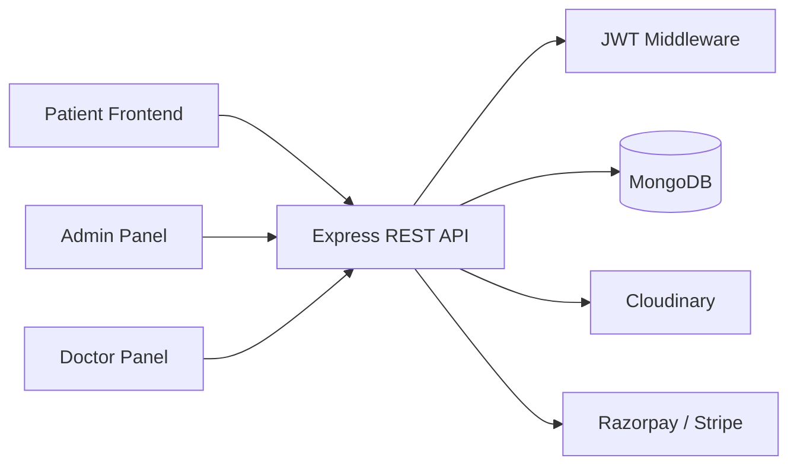
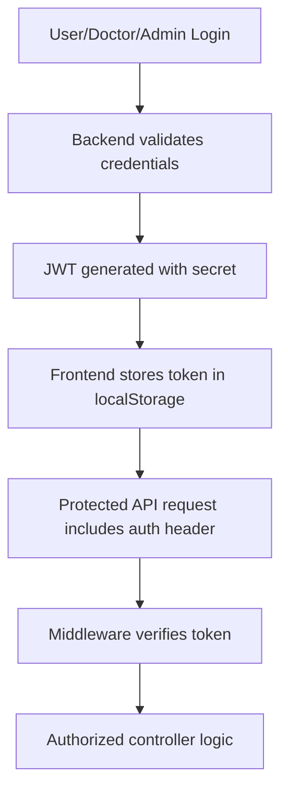
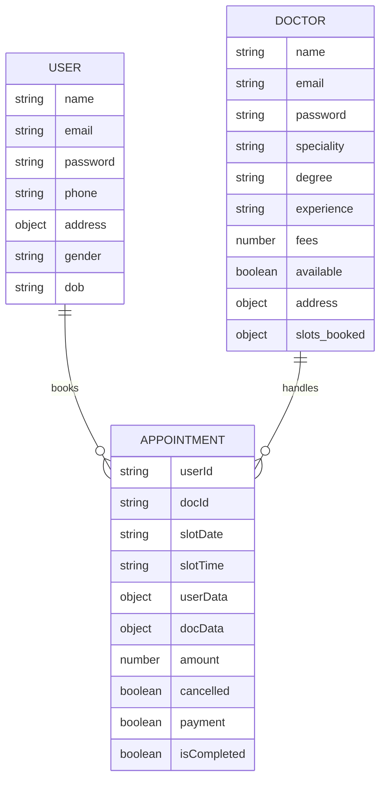

# Hospital Management System

[](https://react.dev/)
[](https://vitejs.dev/)
[](https://nodejs.org/)
[](https://www.mongodb.com/)
[](https://tailwindcss.com/)
[](https://jwt.io/)
[](https://razorpay.com/)
[](https://stripe.com/)

A multi-role healthcare appointment platform that connects patients, doctors, and administrators in a single application flow.

## Overview

This project is a full-stack hospital management system built to streamline healthcare operations across three user journeys:

- Patients can sign up, log in, manage their profile, browse doctors, and book or cancel appointments.
- Doctors can access their dashboard, review appointments, mark them complete, and update availability and profile details.
- Admins can onboard doctors, manage appointments, and monitor key metrics from a centralized dashboard.

The repository contains three separate frontends — a patient portal, an admin/doctor portal, and a shared Express API backend — connected to MongoDB. It also includes file uploads through Cloudinary and payment handling through Razorpay and Stripe.

## Project Overview

### Patient

The patient experience is centered around doctor discovery and appointment management. Patients can create an account, sign in with JWT-based authentication, complete a profile, select a doctor, and book available time slots. They can also view their appointment history and complete appointment payments through Razorpay or Stripe.

### Doctor

Doctor access is designed for operational management. Once logged in, a doctor can view assigned appointments, cancel or complete them, toggle availability, and update profile data. The doctor dashboard also exposes summary metrics such as appointment count and estimated earnings from completed or paid appointments.

### Admin

The admin role controls provider onboarding and operational oversight. Admins can log in with configured credentials, add doctors with profile details and uploaded images, review all appointments, change doctor availability, and view a dashboard summarizing doctor, patient, and appointment counts.

## Features

### Patient Features

- User registration and login
- Profile creation and updates with image upload
- Doctor listing and specialty-based browsing
- Appointment booking based on available slots
- Appointment cancellation
- Appointment history retrieval
- Razorpay payment flow for appointment fees
- Stripe payment flow for appointment fees

### Doctor Features

- Doctor login
- Appointments dashboard
- Appointment completion and cancellation
- Availability toggling
- Doctor profile retrieval and updates
- Dashboard metrics for earnings, appointment count, and patient count

### Admin Features

- Admin login
- Doctor onboarding with uploaded image and details
- Doctor list retrieval and management
- Appointment oversight for the full system
- Bulk appointment cancellation
- Dashboard metrics for platform activity
- Doctor availability changes

## Tech Stack

| Category | Technology |
| --- | --- |
| Frontend | React, Vite |
| Backend | Node.js, Express.js |
| Database | MongoDB, Mongoose |
| Authentication | JWT, bcrypt |
| Styling | Tailwind CSS |
| File Storage | Cloudinary, Multer |
| Payments | Razorpay, Stripe |
| API Communication | Axios |
| Validation | validator |
| Environment Configuration | dotenv |

## Architecture

The application follows a classic client-server structure, where each frontend communicates with the same Express API, which is responsible for validation, authentication, business logic, and database access.



### Architecture Notes

- The patient-facing app and admin/doctor portal are separate Vite React applications.
- The backend exposes REST endpoints for user, doctor, and admin operations.
- JWT middleware validates user access before protected controllers run.
- MongoDB stores users, doctors, and appointments.
- Image uploads are stored through Cloudinary and payment flows are handled through Razorpay and Stripe.

## Project Structure

```text
Hospital-Management-System/
├── admin/
│   ├── src/
│   ├── public/
│   ├── package.json
│   ├── vite.config.js
│   ├── .gitignore
│   ├── .env.example
│   └── README.md
├── backend/
│   ├── config/
│   ├── controllers/
│   ├── middleware/
│   ├── models/
│   ├── routes/
│   ├── server.js
│   ├── package.json
│   ├── .gitignore
│   └── .env.example
├── frontend/
│   ├── src/
│   ├── public/
│   ├── package.json
│   ├── vite.config.js
│   ├── .gitignore
│   ├── .env.example
│   └── README.md
├── LICENSE
└── README.md
```

### Directory Responsibilities

- `frontend/`: patient portal for browsing doctors and booking appointments
- `admin/`: admin and doctor management interface
- `backend/`: Express API, database logic, middleware, controllers, and route definitions
- `backend/models/`: MongoDB schemas for users, doctors, and appointments
- `backend/controllers/`: business logic for user, doctor, and admin actions
- `backend/middleware/`: JWT and file upload middleware
- `backend/config/`: MongoDB and Cloudinary setup

## Getting Started

### Prerequisites

Before running the project locally, make sure the following are installed:

- Node.js
- npm
- MongoDB instance or MongoDB Atlas connection
- Cloudinary account
- Razorpay and/or Stripe account credentials

### Clone the Repository

```bash
git clone <repository-url>
cd <project-directory>
```

### Install Dependencies

```bash
cd backend
npm install
```

```bash
cd ../frontend
npm install
```

```bash
cd ../admin
npm install
```

### Environment Variables

Each app uses `.env` files for local secrets and configuration. Create local copies using the included `.env.example` files and replace placeholders with your own values.

#### Backend `.env`

```env
PORT=4000
MONGODB_URI=your_mongodb_connection_string
RAZORPAY_KEY_ID=your_razorpay_key_id
RAZORPAY_KEY_SECRET=your_razorpay_key_secret
JWT_SECRET=your_jwt_secret
ADMIN_EMAIL=admin@gmail.com
ADMIN_PASSWORD=your_admin_password
CLOUDINARY_NAME=your_cloudinary_name
CLOUDINARY_API_KEY=your_cloudinary_api_key
CLOUDINARY_SECRET_KEY=your_cloudinary_secret_key
```

#### Frontend/Admin `.env`

```env
VITE_BACKEND_URL=http://localhost:4000
VITE_CURRENCY=INR
VITE_RAZORPAY_KEY_ID=your_razorpay_key_id
```

> Keep real credentials and secrets in local `.env` files. Never commit `.env` files to Git. Use the provided `.env.example` files as templates.

### Run the Application Locally

Open three terminals:

#### Terminal 1 — Backend

```bash
cd backend
npm run server
```

#### Terminal 2 — Patient Frontend

```bash
cd frontend
npm run dev
```

#### Terminal 3 — Admin/Doctor Frontend

```bash
cd admin
npm run dev
```

### Production Builds

```bash
cd backend
npm start
```

```bash
cd frontend
npm run build
```

```bash
cd admin
npm run build
```

## API Documentation

The backend exposes REST endpoints under `/api/user`, `/api/doctor`, and `/api/admin`.

### User APIs

| Method | Endpoint | Purpose | Authentication |
| --- | --- | --- | --- |
| POST | `/api/user/register` | Register a new patient | No |
| POST | `/api/user/login` | User login | No |
| GET | `/api/user/get-profile` | Fetch the logged-in user's profile | Yes (`token`) |
| POST | `/api/user/update-profile` | Update profile and optional image | Yes (`token`) |
| POST | `/api/user/book-appointment` | Book an appointment slot | Yes (`token`) |
| GET | `/api/user/appointments` | Get appointment history | Yes (`token`) |
| POST | `/api/user/cancel-appointment` | Cancel an appointment | Yes (`token`) |
| POST | `/api/user/payment-razorpay` | Create Razorpay order | Yes (`token`) |
| POST | `/api/user/verifyRazorpay` | Verify Razorpay payment | Yes (`token`) |
| POST | `/api/user/payment-stripe` | Create Stripe checkout session | Yes (`token`) |
| POST | `/api/user/verifyStripe` | Verify Stripe payment | Yes (`token`) |

### Doctor APIs

| Method | Endpoint | Purpose | Authentication |
| --- | --- | --- | --- |
| POST | `/api/doctor/login` | Doctor login | No |
| GET | `/api/doctor/appointments` | Fetch doctor appointments | Yes (`dtoken`) |
| POST | `/api/doctor/cancel-appointment` | Cancel an appointment | Yes (`dtoken`) |
| GET | `/api/doctor/list` | List all doctors | No |
| POST | `/api/doctor/change-availability` | Toggle doctor availability | Yes (`dtoken` / `atoken`) |
| POST | `/api/doctor/complete-appointment` | Mark appointment as complete | Yes (`dtoken`) |
| GET | `/api/doctor/dashboard` | Fetch dashboard metrics | Yes (`dtoken`) |
| GET | `/api/doctor/profile` | Get doctor profile | Yes (`dtoken`) |
| POST | `/api/doctor/update-profile` | Update doctor profile | Yes (`dtoken`) |

### Admin APIs

| Method | Endpoint | Purpose | Authentication |
| --- | --- | --- | --- |
| POST | `/api/admin/login` | Admin login | No |
| POST | `/api/admin/add-doctor` | Add a doctor with image upload | Yes (`atoken`) |
| GET | `/api/admin/appointments` | Fetch all appointments | Yes (`atoken`) |
| POST | `/api/admin/cancel-appointment` | Cancel an appointment | Yes (`atoken`) |
| GET | `/api/admin/all-doctors` | Fetch all doctors | Yes (`atoken`) |
| POST | `/api/admin/change-availability` | Toggle doctor availability | Yes (`atoken`) |
| GET | `/api/admin/dashboard` | Fetch admin dashboard metrics | Yes (`atoken`) |

## Authentication & Authorization

Authentication is implemented with JWT and role-specific headers.

- Patients send a JWT in the `token` header.
- Doctors send a JWT in the `dtoken` header.
- Admins send a JWT in the `atoken` header.

The backend uses middleware to protect routes:

- `authUser.js` verifies user tokens and attaches `userId`
- `authDoctor.js` verifies doctor tokens and attaches `docId`
- `authAdmin.js` verifies admin tokens and checks the configured admin credentials



This pattern is used throughout the project to separate role-based access for patient, doctor, and admin flows.

## Database Design

The project uses MongoDB with Mongoose models for the main application entities.

### Models

- `userModel.js`: stores patient profile data, including name, email, password hash, image, phone, address, gender, and date of birth.
- `doctorModel.js`: stores doctor profile, specializations, fees, availability, and booked slots.
- `appointmentModel.js`: tracks a booked consultation, including user and doctor references, slot information, amount, payment status, cancellation status, and completion status.



## Key Workflows

### 1. User Registration and Login

1. A patient signs up or logs in from the patient frontend.
2. The frontend sends credentials to `/api/user/register` or `/api/user/login`.
3. The backend validates the input and hashes the password using `bcrypt`.
4. A JWT is returned to the client and saved in local storage.
5. Subsequent protected calls send the JWT in the request headers.

### 2. Appointment Booking

1. A patient browses the doctor list and selects a doctor.
2. The frontend loads available time slots.
3. The patient chooses a date and time and submits the booking.
4. The backend validates availability and creates an appointment record.
5. The booking is stored in MongoDB and returned to the frontend.

### 3. Payment Flow

1. A patient triggers a payment from their appointment section.
2. The backend creates a Razorpay or Stripe payment session/order.
3. The user completes checkout.
4. The backend verifies the transaction and marks the appointment as paid.

### 4. Doctor and Admin Operations

1. A doctor or admin logs in through the admin interface.
2. The backend validates credentials and returns an auth token.
3. Protected dashboard endpoints fetch appointment and profile data.
4. Doctors can complete or cancel appointments, while admins can add doctors and view platform metrics.

## Screenshots

No dedicated screenshot assets were found in the repository, so this section is intentionally reserved for future UI captures.

```text
Screenshots can be added here to showcase the patient, doctor, and admin interfaces.
```

## Security

The project includes the following implemented security and safety measures:

- `bcrypt` password hashing for user and doctor credentials
- JWT-based authentication for protected API routes
- Middleware-based route protection for user, doctor, and admin APIs
- Environment variable configuration for backend secrets and provider credentials
- Input validation for registration and doctor creation flows
- File upload handling through Multer and Cloudinary

This is a practical security baseline for the implemented app, but it should not be interpreted as a full production-security certification.

## Key Engineering Concepts Demonstrated

This project demonstrates a range of practical full-stack engineering concepts:

- REST API design with Express
- Role-based authentication and authorization
- MongoDB schema modeling with Mongoose
- React frontend architecture with context-based state management
- CRUD flows for users, doctors, and appointments
- JWT token handling and secure protected routes
- Axios-driven client-server communication
- Cloudinary-based media uploads
- Payment gateway integration with Razorpay and Stripe
- Tailwind-driven responsive UI development
- Environment-based configuration for local development

## Future Improvements

The following are realistic next steps for the project, but they are not currently implemented:

- Appointment reminders via email or SMS
- Prescription management
- Role-level audit trails and activity logs
- Recurring appointment scheduling
- More advanced analytics and reporting
- Enhanced validation and stricter file upload controls

## Contributing

Contributions are welcome. To contribute:

1. Fork the repository.
2. Create a feature branch.
3. Make your changes.
4. Commit your work with a clear summary.
5. Open a pull request.

## License

This project is licensed under the MIT License. See the [LICENSE](LICENSE) file for details.
