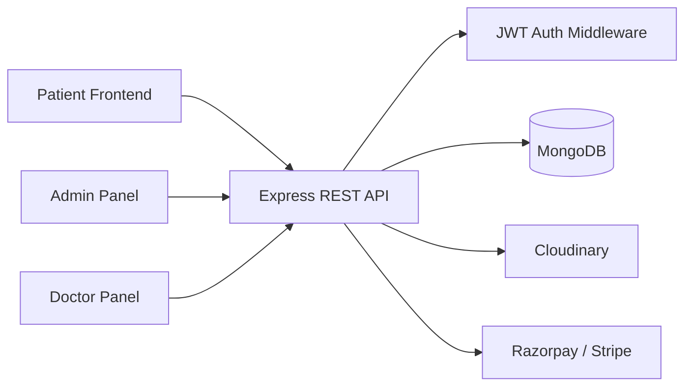
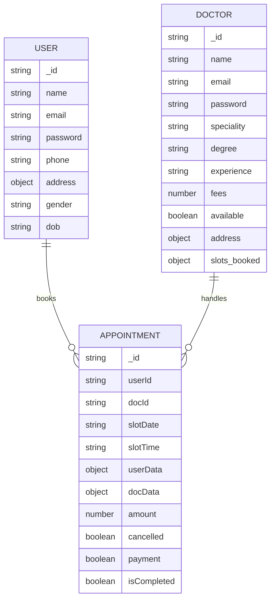

# Hospital Management System

A full-stack healthcare appointment platform built with a React frontend, an Express backend, and MongoDB for data persistence. The project includes a patient-facing portal, a doctor management dashboard, and an admin panel for doctor onboarding and operational oversight.

## Overview

This repository contains a multi-app healthcare management solution designed for appointment booking, doctor directory management, role-based access, and payment processing. The application supports three primary user flows:

- Patients can sign up, log in, edit their profile, browse doctors, and book/cancel appointments.
- Doctors can log in to view appointments, mark them complete, manage availability, and update profile details.
- Admins can log in, add doctors, review appointments, and monitor platform-level metrics.

The product is branded around the Synapse healthcare system in the UI and uses a modular backend architecture with controllers, middleware, and MongoDB models for patient, doctor, and appointment records.

## Features

### Patient/User

- User registration and login with email/password validation
- JWT-based authenticated session handling
- Profile management with name, phone, address, gender, DOB, and photo upload
- Doctor listing and specialty-based browsing
- Appointment booking with available time-slot validation
- Appointment cancellation
- Appointment history and payment flow
- Razorpay and Stripe payment integration for appointment fees
- Profile and appointment data loaded through authenticated API calls

### Doctor

- Doctor login using email and password
- Protected dashboard with appointment and patient summarization
- List of assigned appointments
- Appointment cancellation and completion markers
- Doctor availability toggling
- Doctor profile retrieval and profile updates
- Access to appointment and doctor-related API endpoints via `dtoken`

### Admin

- Admin login using configured admin credentials from environment variables
- Add new doctors with image upload, specialty, qualifications, and clinic details
- View all doctors in the admin directory
- View all appointments in the system
- Cancel appointments
- Toggle doctor availability
- Admin dashboard with counts for doctors, appointments, and patients

## Tech Stack

| Layer | Technology |
| --- | --- |
| Frontend | React, Vite, JavaScript, JSX |
| Admin Panel | React, Vite, JavaScript |
| Backend | Node.js, Express.js |
| Database | MongoDB with Mongoose |
| Authentication | JWT, bcrypt |
| File Uploads | Multer, Cloudinary |
| Payments | Razorpay, Stripe |
| Styling | Tailwind CSS |
| HTTP Client | Axios |
| Validation | Validator |
| Environment Config | dotenv |
| Runtime | Node.js |

## System Architecture

The project is structured as a three-part system: patient frontend, admin panel, and backend API, all connected through REST endpoints and MongoDB.



## Project Structure

```text
project-root/
├── admin/
│   ├── src/
│   ├── public/
│   ├── package.json
│   ├── vite.config.js
│   ├── .gitignore
│   ├── .env.example
│   └── README.md
├── backend/
│   ├── config/
│   ├── controllers/
│   ├── middleware/
│   ├── models/
│   ├── routes/
│   ├── package.json
│   ├── server.js
│   ├── .gitignore
│   ├── .env.example
│   └── .env
├── frontend/
│   ├── src/
│   ├── public/
│   ├── package.json
│   ├── vite.config.js
│   ├── .gitignore
│   ├── .env.example
│   └── README.md
├── README.md
└── .git/
```

### Directory purposes

- `frontend/`: patient portal for browsing doctors, booking appointments, and managing profiles
- `admin/`: management dashboard for admins and doctors with role-based access
- `backend/`: Express server, API routes, controllers, models, middleware, and database configuration
- `backend/models/`: MongoDB schemas for users, doctors, and appointments
- `backend/controllers/`: business logic for user, doctor, and admin actions
- `backend/middleware/`: JWT authorization and upload middleware
- `backend/config/`: MongoDB and Cloudinary configuration

## Getting Started

### Prerequisites

Before running the application, make sure you have the following installed:

- Node.js (v18 or later recommended)
- npm
- MongoDB Atlas or a local MongoDB instance
- Cloudinary account for image uploads
- Razorpay and/or Stripe keys for payment features

### Clone the repository

```bash
git clone <repository-url>
cd "Hospiltal Management System"
```

### Install dependencies

Install backend dependencies:

```bash
cd backend
npm install
```

Install frontend dependencies:

```bash
cd ../frontend
npm install
```

Install admin app dependencies:

```bash
cd ../admin
npm install
```

### Environment Variables

Each app uses `.env` files for local configuration. Example placeholders are included in the project as `.env.example` files.

Backend environment variables used by the code include:

```env
PORT=4000
MONGODB_URI=your_mongodb_connection_string
RAZORPAY_KEY_ID=your_razorpay_key_id
RAZORPAY_KEY_SECRET=your_razorpay_key_secret
JWT_SECRET=your_jwt_secret
ADMIN_EMAIL=admin@gmail.com
ADMIN_PASSWORD=your_admin_password
CLOUDINARY_NAME=your_cloudinary_name
CLOUDINARY_API_KEY=your_cloudinary_api_key
CLOUDINARY_SECRET_KEY=your_cloudinary_secret_key
```

Frontend/admin environment variables used by the code include:

```env
VITE_BACKEND_URL=http://localhost:4000
VITE_CURRENCY=INR
VITE_RAZORPAY_KEY_ID=your_razorpay_key_id
```

> Do not commit real secrets. Keep `.env` files local and use the `.env.example` files as templates.

### Run the application

Start the backend server:

```bash
cd backend
npm run server
```

Start the frontend patient portal:

```bash
cd frontend
npm run dev
```

Start the admin portal:

```bash
cd admin
npm run dev
```

For production builds:

```bash
cd backend
npm start
```

```bash
cd frontend
npm run build
```

```bash
cd admin
npm run build
```

## API Documentation

The backend exposes REST endpoints under `/api/user`, `/api/doctor`, and `/api/admin`.

### User APIs

| Method | Endpoint | Description | Auth |
| --- | --- | --- | --- |
| POST | `/api/user/register` | Register a new patient | No |
| POST | `/api/user/login` | Login a patient | No |
| GET | `/api/user/get-profile` | Fetch current user profile | Yes (`token`) |
| POST | `/api/user/update-profile` | Update profile fields and optional image | Yes (`token`) |
| POST | `/api/user/book-appointment` | Book a consultation slot | Yes (`token`) |
| GET | `/api/user/appointments` | Fetch user appointments | Yes (`token`) |
| POST | `/api/user/cancel-appointment` | Cancel a booked appointment | Yes (`token`) |
| POST | `/api/user/payment-razorpay` | Create Razorpay payment order | Yes (`token`) |
| POST | `/api/user/verifyRazorpay` | Verify Razorpay payment | Yes (`token`) |
| POST | `/api/user/payment-stripe` | Create Stripe checkout session | Yes (`token`) |
| POST | `/api/user/verifyStripe` | Verify Stripe payment status | Yes (`token`) |

### Doctor APIs

| Method | Endpoint | Description | Auth |
| --- | --- | --- | --- |
| POST | `/api/doctor/login` | Doctor login | No |
| GET | `/api/doctor/appointments` | Fetch appointments for doctor | Yes (`dtoken`) |
| POST | `/api/doctor/cancel-appointment` | Cancel a doctor appointment | Yes (`dtoken`) |
| GET | `/api/doctor/list` | List all doctors for frontend use | No |
| POST | `/api/doctor/change-availability` | Toggle doctor availability | Yes (`dtoken` / `atoken`) |
| POST | `/api/doctor/complete-appointment` | Mark appointment as completed | Yes (`dtoken`) |
| GET | `/api/doctor/dashboard` | Fetch dashboard summary data | Yes (`dtoken`) |
| GET | `/api/doctor/profile` | Fetch doctor profile | Yes (`dtoken`) |
| POST | `/api/doctor/update-profile` | Update doctor profile | Yes (`dtoken`) |

### Admin APIs

| Method | Endpoint | Description | Auth |
| --- | --- | --- | --- |
| POST | `/api/admin/login` | Admin login | No |
| POST | `/api/admin/add-doctor` | Add a new doctor and upload image | Yes (`atoken`) |
| GET | `/api/admin/appointments` | Fetch all appointments | Yes (`atoken`) |
| POST | `/api/admin/cancel-appointment` | Cancel any appointment | Yes (`atoken`) |
| GET | `/api/admin/all-doctors` | Fetch all doctors | Yes (`atoken`) |
| POST | `/api/admin/change-availability` | Toggle doctor availability | Yes (`atoken`) |
| GET | `/api/admin/dashboard` | Fetch admin dashboard summary | Yes (`atoken`) |

## Authentication & Authorization

Authentication is implemented with JWT and role-specific headers:

- User token is expected in the `token` header.
- Doctor token is expected in the `dtoken` header.
- Admin token is expected in the `atoken` header.

The middleware files in `backend/middleware/` enforce access restrictions:

- `authUser.js`: validates patient authentication using `JWT_SECRET`
- `authDoctor.js`: validates doctor authentication using `JWT_SECRET`
- `authAdmin.js`: validates admin authentication and compares token payload against the configured admin email/password combination

The admin login uses the configured `ADMIN_EMAIL` and `ADMIN_PASSWORD` environment variables, and the resulting JWT is used to authorize administrative API routes.

## Database Design

The backend uses MongoDB with Mongoose schemas.

### Key models

- `userModel.js`: stores patient data including name, email, password hash, image, phone, address, gender, and DOB.
- `doctorModel.js`: stores doctor details including name, email, password, image, speciality, degree, experience, fees, availability, address, and slot bookings.
- `appointmentModel.js`: stores user and doctor references, appointment time, user/doc details snapshot, amount, payment status, cancellation status, and completion status.



## Application Workflow

### User registration and login

1. The patient signs up from the frontend login/signup form.
2. The frontend sends `POST /api/user/register` or `POST /api/user/login` with email and password.
3. The backend validates input and hashes passwords using `bcrypt`.
4. A JWT is generated and returned to the frontend.
5. The frontend stores the token in local storage and uses it for protected requests.

### Appointment booking

1. The patient selects a doctor from the patient portal.
2. The frontend loads the doctor's calendar and available slots.
3. The user chooses a date/time and submits the booking.
4. The backend checks availability, reserves the slot in the doctor record, and creates an appointment document.
5. The appointment is returned as successful and appears in the user's appointment list.

### Doctor operations

1. A doctor logs in from the admin portal.
2. The backend issues a JWT and stores it as `dtoken` in local storage.
3. The doctor dashboard fetches appointment and profile data from protected endpoints.
4. The doctor can complete or cancel appointments and toggle availability.

### Admin operations

1. The admin logs into the admin portal.
2. The admin panel calls `/api/admin/login` and stores `atoken` in local storage.
3. The admin can add a doctor, review appointments, change availability, and view dashboard metrics.

## Screenshots

No screenshot assets were found in the repository, so this section is intentionally left as a placeholder for future additions.

```text
Screenshots coming soon.
```

## Security Considerations

The implemented security measures visible in the codebase include:

- Password hashing with `bcrypt`
- JWT-based authentication for user, doctor, and admin roles
- Protected routes enforced through middleware
- Environment variables used for secrets and external service configuration
- Cloudinary upload handling for user/doctor images
- Input validation for registration and admin/doctor creation flows

## Error Handling

The backend follows a lightweight JSON-based error pattern. Each controller wraps logic in `try/catch` blocks and returns structured responses such as:

```json
{ "success": false, "message": "Invalid credentials" }
```

The server also includes a port conflict check in `server.js` so it fails clearly if the configured port is already in use.

## Future Improvements

The current codebase is a solid starter healthcare platform and could be extended with:

- appointment reminders via email/SMS
- online prescription generation
- advanced role permissions and audit logs
- recurring appointment scheduling
- reporting and analytics dashboards
- enhanced file validation and upload security
- admin audit trails and activity logs

## Learning / Key Concepts Demonstrated

This project demonstrates several important full-stack development concepts:

- REST API design with Express
- Role-based authentication and authorization
- MongoDB schema modeling and relationships
- React app architecture with context-based state management
- CRUD operations across multiple entities
- JWT token handling for protected endpoints
- File upload and cloud storage integration
- Payment integration using external gateways
- Frontend-to-backend API communication with Axios
- Responsive UI implementation using Tailwind CSS

## Contributing

Contributions are welcome for improvements, bug fixes, and feature additions. To contribute:

1. Fork the repository.
2. Create a feature branch.
3. Make your changes.
4. Submit a pull request with a clear summary of the update.

## License

No license file was found in the repository, so no license is declared for this project.
